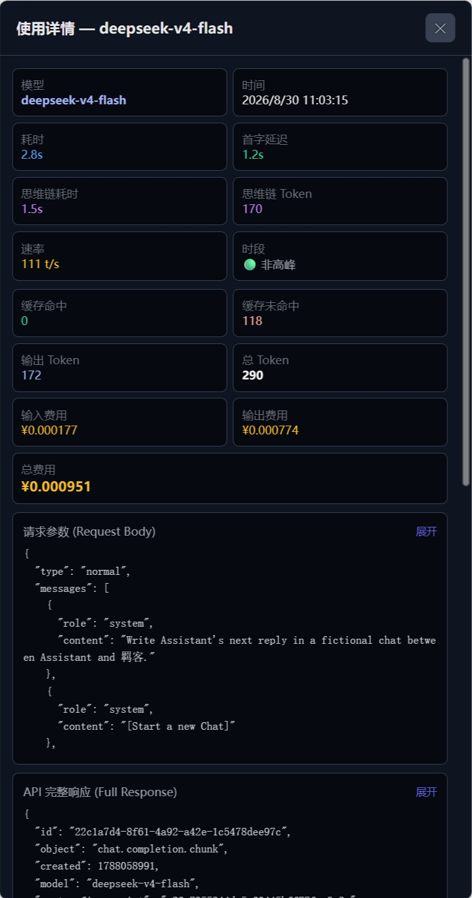
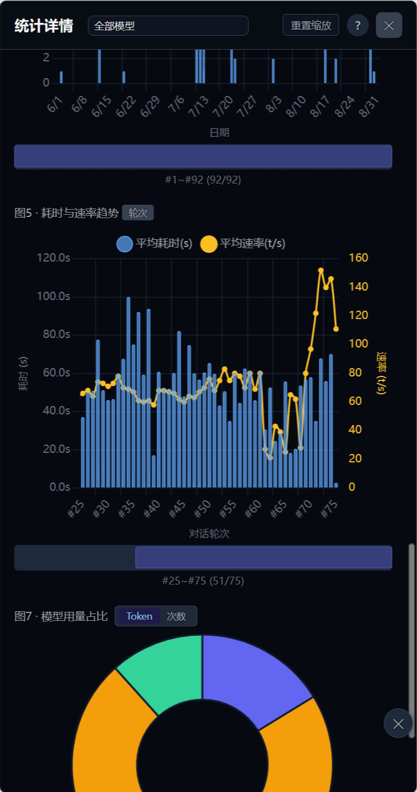
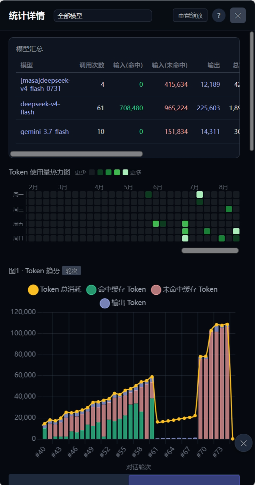
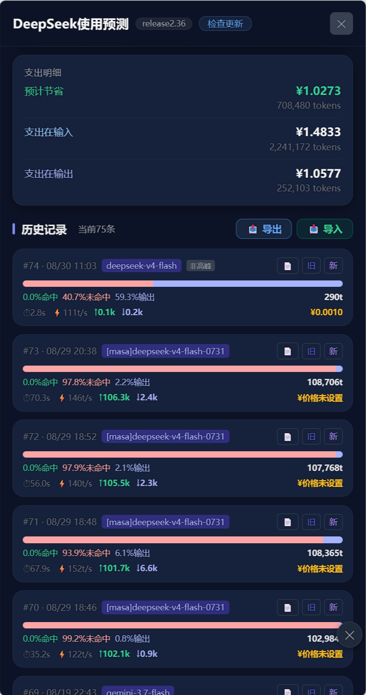
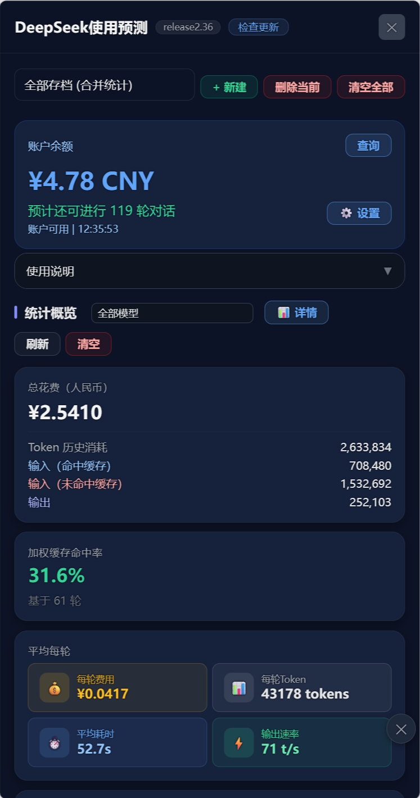

# DeepSeek 使用预测 - SillyTavern酒馆助手 脚本

实时统计和预测 DeepSeek API(和其余兼容API) 的 token 消耗、费用、预测剩余对话数和缓存命中情况。

该项目已从脚本迁移为酒馆扩展，请前往https://github.com/janmk1453/Api-Usage 获取最新更新，未来脚本版仅进行维护性更新

## 预览

<p align="center">
  
  
  
  
  
</p>

## 功能

- **实时统计**：自动记录每次 API 调用的 token 消耗/费用/命中率/速率/以及一切能想到的数据
- **实时预测(DS)**：依照历史对话记录消耗，准确预测未来使用趋势和剩余对话轮数
- **高峰提示**：实时展示高低峰状态，自定义高低峰时段；周末（周六/周日）全天按低谷价计费，不区分峰谷时段
- **余额同步(DS)**：通过API同步DS官方账户余额，准确可视
- **多存档管理**：支持多个存档文件，可切换查看对比不同角色卡的统计数据
- **消息对比**：对比不同对话的请求消息，找出缓存发散点
- **统计图表**：Token/费用趋势、缓存命中率曲线、准确判断token趋势
- **操作便捷**：每张图表独立控制 X 轴范围，支持缩放和平移
- **自动更新**：自动触发更新检查，获取最新版本
- **历史记录导入导出**：完整备份/还原历史记录与统计信息，导出文件不含 API 密钥，旧版本导出文件可在未来版本中继续导入
- **自定义价格与峰谷时段**：自定义模型名称与价格（¥/百万 tokens），自定义高峰时段（支持跨天），兼容未来模型名更新与价格变化

## 下载

前往 [Releases](https://github.com/janmk1453/deepseek-tavern-script/releases) 页面下载最新版本。

| 文件 | 说明 | 推荐 |
|------|------|------|
| `DeepSeek_Statistic_auto_update.json` | 自动更新版（GitHub Pages），导入后自动获取最新脚本 | ✅推荐 |
| `DeepSeek_Statistic_auto_update_jsDelivr_cdn.json` | 自动更新版（jsDelivr CDN），导入后自动获取最新脚本 | 该渠道更新较慢，但国内网络适应性强 |
| `DeepSeek_Statistic_VX.XX.json` | 完整版脚本，需手动导入 | 需要特定版本时使用 |

## 使用方法

### 自动更新（推荐）

1. 下载 `DeepSeek_Statistic_auto_update.json`
2. 在 SillyTavern 的酒馆助手中导入该文件
3. 之后每次启动自动获取最新版本，无需手动更新

### 手动更新

1. 下载 `DeepSeek_Statistic_VX.XX.json`
2. 在 SillyTavern 的酒馆助手中导入该文件
3. 每次更新需重新导入

## 快速开始

1. **配置 API 密钥**：在设置中输入 DeepSeek API 密钥并保存（非必需）
2. **查询余额**：点击「查询」按钮获取账户余额
3. **开始对话**：正常与 AI 对话，插件自动记录统计数据
4. **查看统计**：点击「图表」按钮查看详细统计数据

## 详细功能

### 使用预测

- 依照历史对话记录消耗，准确预测未来使用趋势和剩余对话轮数
- 剩余对话轮数仅基于 DeepSeek 官方 API 的请求数据计算（模型名以 deepseek 开头），其他厂商/供应商的模型数据不计入

### 使用统计

- 总花费（人民币）
- Token 历史消耗
- 输入（命中缓存）/ 输入（未命中缓存）/ 输出
- 加权缓存命中率
- 平均每轮消、平均耗时、平均速率（速率已扣除首字延迟，反映纯生成速度）
- 单次请求首字延迟（TTFT，用户发出请求后到首个输出字符出现的时间），在使用详情中查看
- 支出明细（预计节省 / 支出在输入 / 支出在输出）
- 统计概览支持按模型筛选：右上角下拉选择「全部模型」或历史记录中出现过的任一模型，概览数据随所选模型实时变化

### 消息对比（beta）

1. 在历史记录中找到想对比的两条消息
2. 前者点击「旧」，后者点击「新」
3. 弹出对比面板显示请求消息的文字差异
4. 差异点即缓存发散起始位置（前 N 条相同为缓存命中阶段）

### 统计图表

- **图 1：Token 趋势** - 显示每次对话的 Token 消耗（命中/未命中/输出）
- **图 2：费用趋势** - 显示每次对话的费用变化
- **图 3：缓存命中率** - 显示缓存命中率的变化曲线
- **图 5：耗时与速率趋势** - 平均耗时（柱状）与平均速率（折线）合并展示，双 Y 轴
- **图 7：模型用量占比** - 各模型 Token 占比，可切换查看调用次数占比
- **图表操作**：滚轮缩放、拖拽平移、重置缩放
- **模型切换**：详情页左上角下拉切换「全部模型」或单个模型查看统计数据
- 注意：首次打开图表页面需要加载较长时间，请保证良好网络环境耐心等待

### 存档管理

- 切换不同的存档文件管理多组统计数据
- 删除单个存档或清空全部存档
- 数据保存在 SillyTavern localStorage 中

### 历史记录导入导出

- 在「历史记录」标题行最右侧点击「📤 导出」下载完整数据（全部存档、当前存档、余额、设置、消息计数），导出文件**不含 API 密钥**
- 点击「📥 导入」选择导出的 JSON 文件，可选择「覆盖导入」或「合并导入」
  - 覆盖导入：整体替换当前数据，结果与导出时完全一致
  - 合并导入：仅新增存档或按时间戳合并同存档的历史记录，保留当前余额与设置
- 导入后自动根据历史记录重算所有统计汇总，确保完整正确还原
- 导出文件带格式版本号：旧版本导出的文件可被未来脚本正常导入（向后兼容）；格式结构升级时会保留迁移支持；若文件版本高于脚本支持范围会提示升级脚本

### WebDAV 云同步（多端同步 / 云备份）

- 在「设置」面板底部「WebDAV 云同步」区域填写服务器地址、用户名、应用密码与（可选）远程子路径，点击「☁️ 立即同步」即可与 WebDAV 服务器（如坚果云）双向合并
- **双向合并、绝不单向覆盖**：先拉取云端、与本地按时间戳合并、再把合并结果上传。因此上传不会用本地旧数据覆盖云端新数据，下载也不会覆盖本地已更新的数据
  - 存档按存档名并集、历史记录按时间戳去重合并（同一时间戳保留本地更完整的记录），天然无重复、无遗漏
  - 余额、设置等元数据按最后修改时间晚者胜（平局保留本地），多端各改不同项时以各自最新为准
- **严格白名单、不上传敏感数据**：同步包仅含统计数据、设置、余额与消息计数，**不含聊天内容/提示词，也不含 API 密钥**（密码独立加密存储于本地，绝不进同步包与日志）
- **安全约束**：服务器地址强制使用 https，明文 http 将被拒绝以保护凭据；远程文件固定名为 `DeepSeekStatSync.json`
- 首次同步时若云端无文件则直接上传；云端文件损坏或格式不符时仅报错、**不覆盖云端**

#### 关于浏览器跨域（CORS）与 CORS 代理（重要）

浏览器出于安全限制，向**不返回 CORS 头**的跨域地址发起带 `Authorization` 的请求会被直接拦截。实测坚果云 WebDAV 的预检（OPTIONS）返回 `401` 且不含 `Access-Control-Allow-Origin`，因此**网页内直接同步坚果云必然失败**（提示「浏览器跨域(CORS)被拦截」）。

解决方式（任选其一，代理地址填到「CORS 代理」框）：
1. **SillyTavern 内置 CORS 代理（最推荐）**：改酒馆安装目录 `config.yaml` 的 `enableCorsProxy: true` 并重启酒馆。该代理与酒馆页面同源，浏览器不发跨域预检、凭据也只在本机后端与坚果云之间传输，最安全。代理框填写与你打开酒馆**相同的 host:port**，例如 `http://127.0.0.1:8000/proxy?url=`（端口见 config.yaml 的 `port`，默认 8000；URL 必须带 `?url=`）。
2. **自建 Cloudflare Worker 等代理**：脚本会把真实请求 URL 作为路径参数（`代理地址/ + encodeURIComponent(真实URL)`，代理根路径以 `/` 结尾）发往代理，由代理在服务端转发并返回 CORS 头。**切勿使用陌生公共代理，会泄露 WebDAV 账号密码**。

**最简 Cloudflare Worker 代理示例**（免费、部署即用，记得在 Worker 设置中允许 CORS）：

```js
export default {
  async fetch(request) {
    const url = new URL(request.url);
    const target = url.pathname.slice(1); // 去掉前导 /
    if (!target) return new Response('missing target', { status: 400 });
    const realUrl = decodeURIComponent(target);
    const init = {
      method: request.method,
      headers: request.headers,
      body: ['GET', 'HEAD'].includes(request.method) ? undefined : request.body,
      redirect: 'follow'
    };
    const resp = await fetch(realUrl, init);
    const newHeaders = new Headers(resp.headers);
    newHeaders.set('Access-Control-Allow-Origin', '*');
    newHeaders.set('Access-Control-Allow-Methods', 'GET, PUT, MKCOL, OPTIONS, DELETE');
    newHeaders.set('Access-Control-Allow-Headers', 'Authorization, Content-Type');
    return new Response(resp.body, { status: resp.status, headers: newHeaders });
  }
}
```

> 使用 ST 内置代理时「CORS 代理」框填 `http://<打开酒馆的host:port>/proxy?url=`（含 `?url=`）；使用 Worker 时代理地址建议为根路径并以 `/` 结尾（如 `https://你的域名/`），上面的 Worker 约定真实 URL 位于路径开头，若代理部署在子路径请相应调整 Worker 对 `pathname` 的解析。
```


### 设置选项

- **自动校准余额**：设置自动查询余额的间隔
- **自定义余额**：手动设置余额，设置后将覆盖 API 查询值
- **新价格机制**：兼容 DeepSeek 2026年8月17日起的峰谷定价机制，支持设置生效日期；高峰时段可自定义多个时间段（结束早于开始视为跨天，如 22:00~次日02:00）；峰谷计价仅针对 DeepSeek 官方模型，周末（周六/周日）全天按低谷价计费
- **模型与价格**：自定义模型名称与价格（¥/百万 tokens），内置模型价格可覆盖、不可删除，可新增自定义模型；价格或时段变更后自动按当前配置重算历史费用
- **调试模式**：模拟单次对话的 token 消耗，不产生 API 费用
- **峰值提示小圆点**：在酒馆右上角（顶栏下方）显示高峰提示小圆点，高峰时段红色、临近高峰（10分钟内）黄色、非高峰绿色；半透明不影响使用，可拖动移动并自动记忆位置，可在设置中一键重置位置，拖动时自动保持与屏幕四边的距离便于选中，且仅在主聊天页面显示、层级保持在酒馆内容之上与插件面板之下，不会遮挡任何插件界面；周末（周六/周日）全天显示非高峰（低谷价）状态

## TODO

- [ ] 实现更准确的余额预测
- [ ] 可视化使用预测和趋势
- [x] 图表中显示高峰/非高峰时段标记
- [ ] 重构UI
- [x] 实现脚本自动更新

## 已知问题

- 极端窗口比例时面板可能错位
- GitHub Pages 缓存导致自动更新存在十分钟左右延迟，jsDelivr CDN存在超过24小时的延迟
- 面对数百条记录可能存在性能问题

## 更新日志

### 2.36
- 新增：WebDAV 云同步（设置页「WebDAV 云同步」区域），支持与坚果云等 WebDAV 服务器进行双向合并同步，实现多端同步与云备份
- 新增：同步采用 pull-merge-push 双向合并，按时间戳去重合并历史记录，元数据按最后修改时间晚者胜，确保不覆盖、不遗漏、不重复
- 新增：同步包严格白名单，仅同步统计/设置/余额，不含聊天内容与 API 密钥；密码独立加密存储；强制 https

### 2.35
- 修复：提交记录每轮费用、支出明细费用、历史记录每次请求费用在实时统计时始终为 0 的问题（根因为 processUsage 中将 lu.cost 误写为数字导致下游 .total/.input/.output 取值为 undefined，刷新网页后由 recalcAllCosts 重算才恢复正常）

### 2.34
- 历史记录中所有外显的模型名称（概览/图表模型下拉、模型汇总表、饼图标签、历史条目徽章）改为直接显示请求/响应中的真实模型名，不再使用 V4F/V4P/DS- 等简称

## 技术说明

- **自动更新原理**：通过 GitHub Pages 提供最新的 JavaScript 脚本，SillyTavern 启动时自动加载
- **数据存储**：所有数据保存在 SillyTavern 的 localStorage 中，不会上传到任何服务器
- **API 密钥安全**：密钥使用 XOR 加密存储，但仍建议使用权限受限的 API 密钥

## 许可证

MIT License
